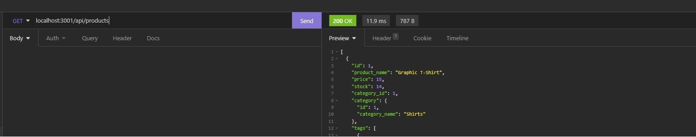

**Project Title:**

E-Commerce Backend

---

**Project Description/Summary:**

Building the back-end for an e-commerce site - leverages a working Express.js API and configures it to use Sequelize to interact with a MySQL database.

---

**Live Site:**

As is this a non-deployed application - there is no live site - look at the installation instructions for further guidance.

---

**Technology Used:**

- JavaScript
- Express.js
- Sequelize
- MySQL

---

**Installation:**

Use _npm i_ or _npm install_ to download the necessary npm packages.

Next, log into MySQL with the following command _mysql -u root -p_ and enter in your MySQL password.

Then, after your login is successful, run _source db/schema.sql_ to use the schema.

After this, quit using the _quit_ command.

Open a Powershell terminal and enter _npm run seed_.

Finally, you can run **npm start** to begin the application and go to http://localhost:3001 via Insomnia or your local browser and begin using the /api endpoints.

---

**Screenshot and Walkthrough Video:**

Walkthrough Video: [Here](https://watch.screencastify.com/v/pIgrtJGg4Z5tqOUiwfTg)
